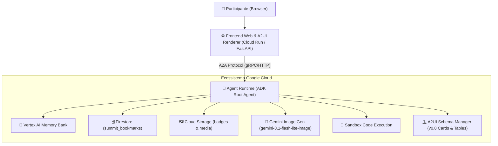

# 🚀 Cloud Summit AI Concierge — Build with Gemini (Track 3)


> **Projeto Oficial do Track 3 — Build with Gemini**  
> Assistente inteligente com IA Agêntica para o Google Cloud Summit, construído com o **Agent Development Kit (ADK)** do Google, equipado com **Memory Bank**, persistência no **Firestore**, geração de mídia com **Gemini Image**, renderização de componentes ricos com **A2UI v0.8** e proxy web em **Cloud Run**.

---

## 🏷️ Capacidades Integradas

`🧠 Memory` · `🗄️ Firestore` · `🖼️ Storage` · `🔧 Tools` · `📖 RAG` · `🎨 Image Gen` · `🪟 A2UI` · `🌐 Cloud Run`

---

## 🧩 Visão Geral e Arquitetura

O **Cloud Summit AI Concierge** resolve a navegação e experiência dos participantes durante o Google Cloud Summit:
1. **Navegação Inteligente na Agenda:** Busca palestras, palestrantes e trilhas técnicas (com foco na Trilha 3 de IA Agêntica).
2. **Favoritos e Agenda Pessoal:** Salva sessões no Google Cloud Firestore com confirmação instantânea.
3. **Memória de Longo Prazo:** Registra interesses técnicos e preferências de cada participante via Vertex AI Memory Bank.
4. **Crachás Visuais Gerados por IA:** Cria credenciais e crachás personalizados com o modelo `gemini-3.1-flash-lite-image` e salva no Google Cloud Storage.
5. **Cálculo de Itinerários e Intervalos:** Valida tempos de sessão, pausas para networking e deslocamentos entre salas.
6. **Interface Gráfica com A2UI:** Exibe cards e tabelas estruturadas nativas através do protocolo A2UI v0.8.



---

## 🛠️ Ferramentas Disponíveis no Agente

| Ferramenta | Descrição | Integração |
|---|---|---|
| `search_sessions` | Consulta palestras por tema, palestrante ou trilha | Catálogo de Conferência |
| `get_session_details` | Retorna sala, horário, sinopse e palestrantes | Catálogo de Conferência |
| `bookmark_session` | Adiciona palestra à agenda pessoal do participante | Google Cloud Firestore |
| `list_bookmarked_sessions` | Lista as palestras salvas pelo participante | Google Cloud Firestore |
| `generate_attendee_badge` | Gera crachá visual exclusivo para o participante | Gemini Image + Cloud Storage |
| `calculate_schedule_timing` | Calcula grade de horários, intervalos e folgas de trânsito | Sandbox Python |

---

## 💻 Como Executar Localmente

### 1. Clonar e Instalar Dependências
```bash
git clone https://github.com/erbernardino/buildwithgemini-cloudsummit.git
cd buildwithgemini-cloudsummit
uv sync
```

### 2. Executar no ADK Playground
```bash
agents-cli playground
```
Acesse `http://localhost:8080` no navegador para interagir com o agente, testar chamadas de ferramentas e visualizar os cards A2UI.

### 3. Executar o Frontend FastAPI
```bash
cd frontend
pip install -r requirements.txt
python main.py
```
Acesse `http://localhost:8080` para utilizar a interface customizada do Google Cloud Summit com chips interativos e renderização nativa de A2UI.

---

## 🧪 Executando os Testes Unitários

```bash
python3 -m unittest discover -s tests/unit
```
Todos os testes cobrem busca de sessões, favoritos, cálculos de cronograma e geração de crachás.

---

## 📚 Documentação (Google OKF)

Este repositório segue rigorosamente as diretrizes do **Google's Open Knowledge Format (OKF)**:
- [[docs/index|Índice Central do Conhecimento]]
- [[docs/architecture|Decisões Arquiteturais e Especificação de Componentes]]
- [[docs/guide-swag|Guia de Envio para Swag e Galeria de Projetos]]
- [[docs/log|Histórico Técnico de Alterações (Changelog OKF)]]

---

## 📄 Licença

Projeto desenvolvido para a Trilha 3 do workshop Build with Gemini — Google Cloud Summit.
