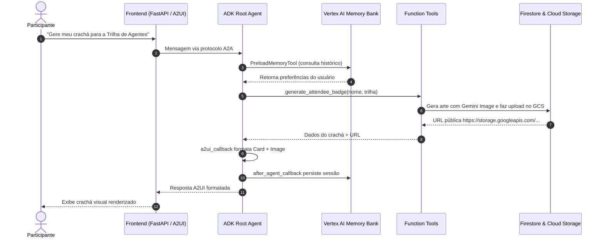

# 🏛️ Arquitetura do Sistema — Cloud Summit AI Concierge

Este documento detalha o desenho arquitetural, o fluxo de dados e os contratos de interface utilizados no desenvolvimento do agente.

---

## 1. Visão Macro da Arquitetura

O projeto divide-se em três camadas operacionais principais:
1. **Camada de Apresentação (Frontend & A2UI):**
   - Servida pelo **FastAPI** e hospedada no **Google Cloud Run**.
   - Integra o renderizador minimalista de **A2UI v0.8**, transformando descrições JSON em cartões visuais (cards), colunas, linhas e imagens.
2. **Camada de Inteligência e Orquestração (ADK Root Agent):**
   - Implementada sobre o **Google Agent Development Kit (ADK)** e gerida pelo `agents-cli`.
   - Utiliza modelos **Gemini** (`gemini-2.5-flash` / `gemini-flash-latest`) para raciocínio, decomposição de consultas e seleção de ferramentas.
3. **Camada de Dados e Mídia (Google Cloud Services):**
   - **Vertex AI Memory Bank:** Memória persistente de longo prazo entre sessões para cada participante.
   - **Google Cloud Firestore:** Coleção `summit_bookmarks` para salvar a agenda pessoal e favoritos.
   - **Google Cloud Storage (GCS):** Bucket público para servir artefatos visuais de crachás gerados pelo modelo `gemini-3.1-flash-lite-image`.
   - **Agent Engine Sandbox:** Ambiente de execução isolado de Python para cálculo de tempo e deslocamento.

---

## 2. Diagrama de Sequência de Atendimento

---

## 3. Especificação das Ferramentas (Function Tools)

### `search_sessions(query: str, track: str = "")`
- **Objetivo:** Filtrar o catálogo de conferência por termos-chave ou trilha técnica.
- **Entrada:** String de consulta e filtro opcional por trilha.
- **Saída:** Lista de sessões com horários, salas, palestrantes e sinopse.

### `bookmark_session(session_id: str, attendee_id: str)`
- **Objetivo:** Adicionar palestra à coleção do participante no Firestore.
- **Entrada:** `session_id` e identificador do participante (`attendee_id`).
- **Saída:** Confirmação com metadados do agendamento.

### `generate_attendee_badge(attendee_name: str, company: str, track_interest: str)`
- **Objetivo:** Gerar arte do crachá com o modelo `gemini-3.1-flash-lite-image`, salvar nos artefatos locais e realizar upload no bucket público do GCS.
- **Saída:** Dicionário com a URL pública HTTPS pronta para inclusão em componentes A2UI.

### `calculate_schedule_timing(session_durations_minutes: list[int], start_hour: float)`
- **Objetivo:** Calcular os blocos de horário, coffee-break e término estimado da programação.
- **Saída:** Timeline completa com folgas de trânsito validadas.
